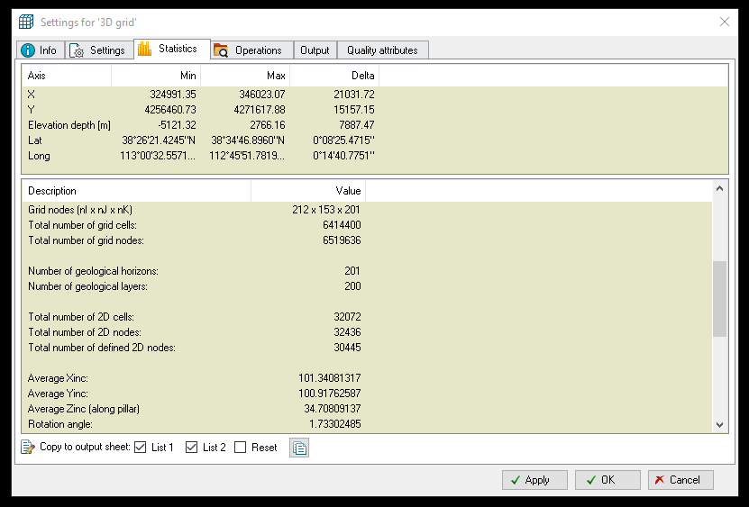
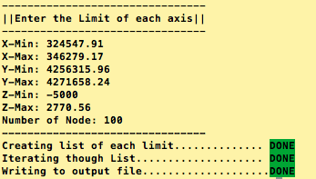
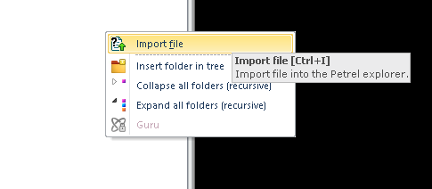
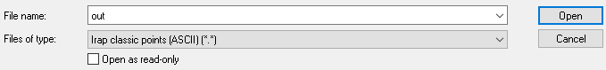
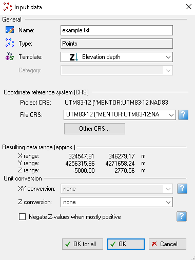
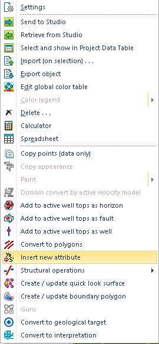
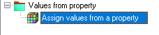
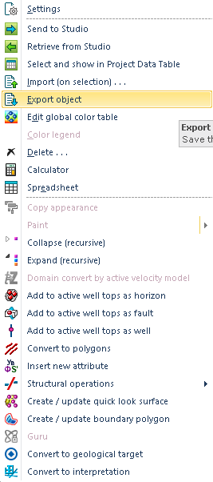
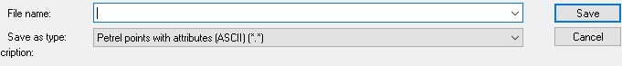
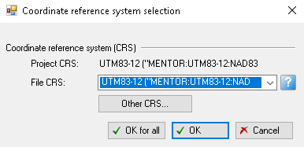

# A Workflow of Nodal Attributes Generation from Petrel

## Developers

* Miu-Lun (Andy) Lau
* Yidong Xia

## Introduction
This document describes the workflow to generate a text doucment containing nodal coordinates with attributes from [Petrel](https://www.software.slb.com/products/petrel). In reservoir engineering, Petrel is often used to create models of faults and other geological features. The following workflow outline the procedure to extract the attributes data from Petrel.  

__The workflow consists of three sections:__

* **Section 1.** Record Nodal boundaries from **Petrel** 
* **Section 2.** Use __SplitSquareGrid script__ to generate a nodal file
* **Section 3.** Extract Attributes Data from **Petrel** into Nodal file

Currently __Section 2__ is accomplished though Python script, where __Section 1__ and __Section 3__ involves manual operation. 
## Prerequisites
A list of software packages required for this workflow is as below:

* Python (Version 2.7.13)
* [Petrel](https://www.software.slb.com/products/petrel)

## WorkFlow
### Section 1. Identify Nodal Boundaries from Petrel

* Start **PETREL**
* Open Petrel project file **"example.ptd"**
* On Models Toolbars and expand your desire models.
* Scroll down to **3D grid**, rightclick and select **Settings**

* Navigate to **Statistics** tab and record the XYZ boundaries on **AXIS** and the average Xinc,Yinc, and Zinc on **Description**


### Section 2. Use SplitSqaureGrid Python Script to generate Nodal File

* With nodal boundaries known, navigate to **../SplitSquareGrid** and enter the command:

```
./run_test
```

* Enter the limits of each axis, and the number of cells in each direction.

	
	
* A text document named **example.txt** that contain all nodes is generated in the same directory. 


### Section 3. Extract Attibutes Data from PETREL into Nodal File

* Start **PETREL**
* Open Petrel Project **"example.ptd"**
* Right click on blink space inside **Input Toolbar** and select **Import File**
	
	

* Navigate to the Nodal File(**"example.txt"**) select **Open** Make sure the format is **Irap Classic Points(ASCII)**

	

* A window call **Input Data** will show up, make sure the Project(**"example.ptd"**) coordinates references system(CRS) and file(**"example.txt"**) is the same.
* Uncheck **[Neglect Z value when mostly positive]** and select **OK**

	

__________________________________
* To check if the Nodal File completely encapsulate the Petrel Project file
	* 	In Model Toolbar, check **[Top]**, **[Horizon]** and **[Bottom]**
	
_____________________________________

* In Input Toolbar,
	* Right click on **example.txt**
	* Select **Insert new attributes** and choose **Continous**
	
		
	
* In the operations tabs,
	* Expand **"expand values from property"** and select **"Assign values from properties"**
	* On the right space, expand the Models and select the properites
	
		
	
	* Select one set of attributes from models toolbar
	* Select right arrows to import attibutes and choose **Run** to apply

		
		
	* Repeat for additional properties.
* Right click on the Grid file (**example.txt**),
	* Select **Export Object**
	
		
	* Enter filename and change the format to **Petrel Points with Attributes** 

		
	
	* Again, check to make sure both file have the same CRS, and choose __OK__ to export 

		


## Side Note

* Make sure to check the units from Petrel. In geophysics, density is often expressed in **g/cm^3** and porosity as a __part out of 100__. 
	* __TetgenMESH__ has options to convert unit into standard unit(SI)
 
* In Petrel, __null__ values will automatically change to __-999__. 